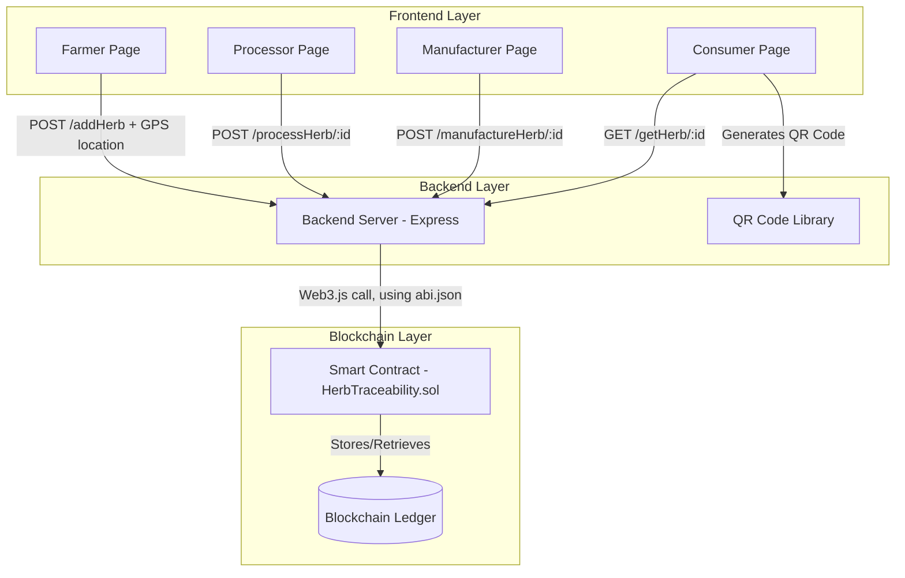

AyurTrace – Blockchain-Based Herb Traceability System

AyurTrace is a blockchain-powered traceability system for Ayurvedic herbs. It combines smart contracts, GPS geo-tagging, and QR-code verification to track herbs from farm to consumer, helping reduce fraud and reliance on manual paper-based record keeping in the Ayurvedic supply chain.

Problem

The Ayurvedic herb supply chain relies heavily on manual paper records, making it vulnerable to fraud, mislabeling, and a lack of transparency about where herbs actually come from. AyurTrace addresses this by creating a tamper-resistant, verifiable record of a herb's journey using blockchain.

How It Works

AyurTrace uses a 3-layer verification system:

GPS Geo-Tagging – Captures the herb's origin location using the device's live GPS coordinates at the point of harvest.
QR Code Scan – Each herb record can generate a unique QR code linking directly to its on-chain traceability record for easy verification.
Blockchain Hash – Every update (collection, processing, packing) is recorded immutably on-chain via a smart contract, ensuring the data can't be altered after the fact.

Together, these layers provide a transparent, tamper-resistant record of a herb's journey across the supply chain.

Roles & Workflow
Farmer – Registers a new herb with name, GPS-captured location, and quantity. Status: "Collected by Farmer"
Processor – Updates status by herb ID. Status: "Processed by Processor"
Manufacturer – Updates status by herb ID. Status: "Packed by Manufacturer"
Consumer – Looks up a herb by ID to view its full record and generate/scan a QR code for verification
Tech Stack
Blockchain / Smart Contracts: Solidity (HerbTraceability.sol)
Backend: Node.js, Express, Web3.js (server.js)
QR Code Generation: Client-side via qrcodejs (consumer.html)
GPS Geo-Tagging: Browser Geolocation API (farmer.html)
Frontend: HTML/JS (role-based pages for Farmer, Processor, Manufacturer, Consumer)
Project Structure
blockchain/   → Smart contract (HerbTraceability.sol)
backend/      → Express server + contract ABI (server.js, abi.json)
frontend/     → Role-based HTML pages (farmer, processor, manufacturer, consumer)
Getting Started
bash
## System Architecture



### Layer Breakdown

**1. Frontend Layer (HTML/JavaScript)**
Four role-based pages — Farmer, Processor, Manufacturer, Consumer — each sending requests to the backend. The Farmer page captures real GPS coordinates via the browser's Geolocation API. The Consumer page generates a scannable QR code linking to the herb's record.

**2. Backend Layer (Node.js, Express)**
Receives requests from the frontend and translates them into blockchain transactions using the Web3.js library. Uses `abi.json` to know how to communicate with the deployed smart contract.

**3. Blockchain Layer (Solidity Smart Contract)**
`HerbTraceability.sol` defines the on-chain logic — creating new herb records and updating their status at each supply chain stage. Once written, records are immutable.

### Data Flow Summary

```
Farmer submits herb (name, GPS location, quantity)
        ↓
Backend calls addHerb() on smart contract
        ↓
Record stored on blockchain — status: "Collected by Farmer"
        ↓
Processor/Manufacturer update status by ID (via backend → smart contract)
        ↓
Consumer looks up herb by ID
        ↓
Backend fetches record from blockchain, returns to frontend
        ↓
QR code generated, linking to the record
```

# Install dependencies (inside backend/)
npm install

# Start the server
node server.js

Then open the relevant frontend HTML file in your browser to access the interface.

Status

An IEEE conference paper documenting this system's design and methodology has been submitted and is currently under peer review.

Contributors

Developed as a collaborative team project.

Divya K — B.Tech Computer Science, Presidency University
